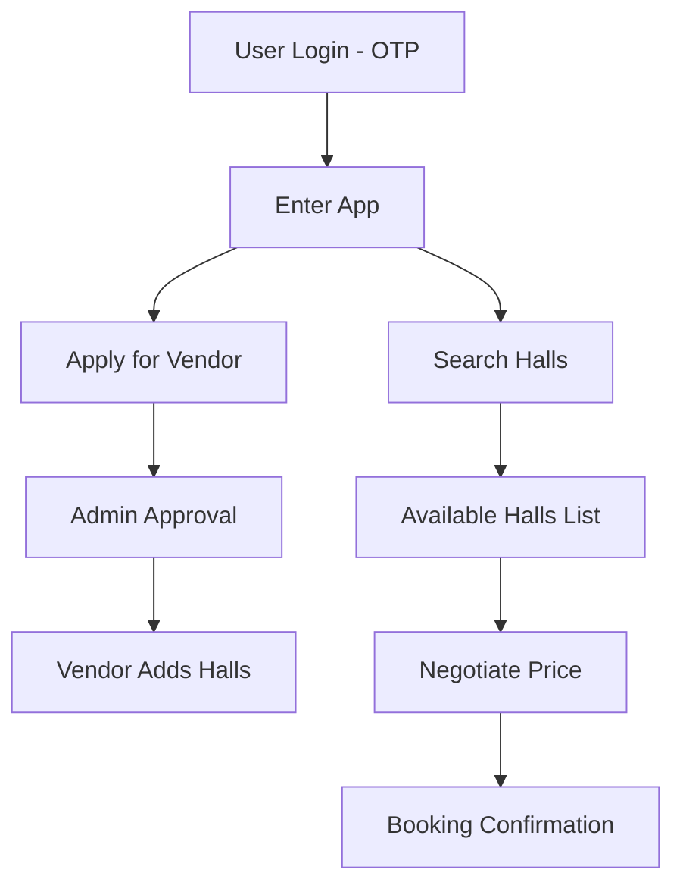

# 🏢 Hall Booking Marketplace (Backend Project)

A scalable backend system for a **hall booking marketplace**, where users can search, negotiate, and book halls, while vendors can onboard, manage listings, and sell their services.

---

## 🚀 Features

### 🔐 Authentication

* OTP-based login using mobile number
* Secure JWT-based authentication

### 👤 User & Vendor System

* Users can apply to become vendors
* Admin approval required for vendor onboarding
* Role-based access (User / Vendor / Admin)

### 🏪 Vendor Management

* Vendors can:

  * Add halls
  * Update hall details
  * Manage pricing
  * Set availability (date & time slots)

### 🔍 Smart Search

* Search halls by:

  * City
  * Date
  * Time
* Shows only **available halls** (no double booking)

### 💰 Negotiation System

* Users can send price offers
* Vendors can:

  * Accept ✅
  * Reject ❌
  * Counter 🔁

### 📅 Booking System

* Book hall based on selected date & time
* Prevents double booking
* Slot locking mechanism

### 🔔 Notifications

* OTP verification
* Booking confirmation
* Negotiation updates

---

## 🧠 System Flow

---

## 🗄️ Database Design (Core Collections)

* **User**
* **Vendor**
* **Hall**
* **Availability**
* **Booking**
* **Negotiation**
* **Document**
* **Address**

---

## ⚙️ Tech Stack

* **Backend:** Node.js, Express.js
* **Database:** MongoDB (Mongoose)
* **Authentication:** JWT + OTP
* **Validation:** Joi
* **File Storage:** AWS S3
* **Caching (optional):** Redis
* **Containerization:** Docker
* **Deployment:** AWS / VPS
* **Reverse Proxy:** Nginx
* **CI/CD:** GitHub Actions

---

## 📦 API Modules

* Auth (OTP Login)
* Vendor Onboarding
* Hall Management
* Search & Availability
* Booking
* Negotiation
* Admin Panel APIs

---

## 🔐 Security Features

* JWT Authentication
* Input Validation (Joi)
* Role-based Authorization
* Secure OTP handling (hashed + expiry)
* Rate limiting (recommended)

---

## 📈 Future Improvements

* 💳 Online Payments Integration
* 📊 Analytics Dashboard
* ⭐ Reviews & Ratings
* 📍 Geo-location based search
* 📱 Mobile app integration

---

## 💡 Project Goal

To build a **production-ready backend system** that demonstrates:

* Scalable architecture
* Real-world business logic
* Clean API design
* Advanced backend concepts (auth, booking, negotiation)

---

## 👨‍💻 Author

**Muhammad Husnain Swati (Backend Developer)**
Focused on building scalable backend systems.

---
